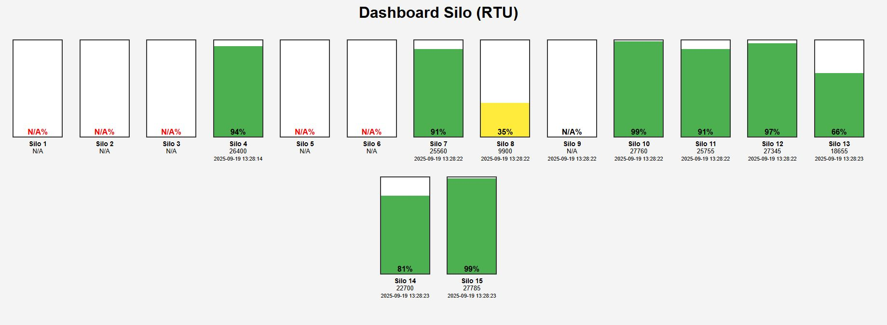

<p align="center">
  
  
  
  
  
  
</p>

<p align="center">
  <strong>Real-time industrial dashboard for Modbus RTU silo monitoring</strong><br>
  Built with Python, Flask & pymodbus • Logs & visualizes live data • Ready for production
</p>

---


# Modbus RTU Comunication and Silo Dashboard

A Python-based application for **polling silo data via Modbus RTU** and displaying the values in **real-time through a web-based dashboard**.

Built for industrial environments with multiple Modbus slave devices, this system is designed to be **robust, extendable, and easy to monitor**, both in log files and visually.

---

## Preview



---

## Features

- Polls 16 Modbus RTU slave devices every 3 minutes *(customizable)*
- Validates and logs readings from each slave (register 10)
- Real-time dashboard showing:
  - Quantity
  - Fill percentage (visual)
  - Device status (online/offline)
  - Last successful reading timestamp
- Color-coded silo fill levels:
  - 🟢 Green: >50%
  - 🟡 Yellow: 20–50%
  - 🔴 Red: <20%
- Logging to file + console with timestamps
- Modular design, ready for future extensions (e.g. DB integration)
- Accessible from other devices on the network (Flask runs on `0.0.0.0`)

---

## Architecture
````
.
├── App.py # Main application (Flask + Modbus polling)
├── templates/
│ └── dashboard.html # Web dashboard UI (auto-refreshing)
├── LOG/ # Rotated log files (polling history)
├── update.sh # Git pull + auto-restart (optional)
└── README.md
````

---

## Modbus RTU Configuration

- Port: `/dev/ttyUSB0`
- Baudrate: `115200`
- Parity: `Even`
- Stop bits: `1`
- Register read: Holding Register at address `10`
- Slaves: `1` to `15`

> Each polling loop includes a short delay between requests to avoid overload.

---

## Web Dashboard

Access the live dashboard from any device in the same network:
    http://<server-ip>:5000

### Silo UI

Each silo includes:

- Dynamic fill level (green, yellow, red)
- Fill percentage (always visible)
- Raw value
- Last successful read time
- Offline state (gray + red text)

---

## Logging

- File: `LOG/modbus_polling-YYYYMMDD.log`
- Rotated daily (auto-created by the app)
- Logged:
  - Success/failure per slave
  - Read values + percentages
  - Connection issues
- Output is also visible on console in real time

---

## Installation

### 1. Install Python environment

```bash
git clone https://github.com/SinghProbjot/ModbusRTU
python3 -m venv venv
source venv/bin/activate
pip install -r requirements.txt
```
Requirements:
```bash
- Flask

- pymodbus

- pyserial 
```
### 2. Run the App
```bash
python3 App.py
```
Or expose via gunicorn and systemd for production.

## Future Features

- Write valid readings to Microsoft SQL Server (DB integration)

- Historical graph and data export

- Dashboard controls: manual update, diagnostics, etc.

- Authenticated access (optional)

## Developer Notes

- All data is stored in RAM (silo_data dictionary)

- Dashboard auto-refreshes every 5 seconds (via meta tag)

- Modbus client uses pymodbus.client.serial.ModbusSerialClient

- Threading used to keep polling separate from web server

- Safe multithreading with shared silo_data state

## Version Control / Deployment

- Git repo is safe for regular updates (venv/, LOG/, etc. are ignored via .gitignore)

 - Includes optional update.sh script:

    - git pull

    - Restart service (if under systemd)

- Recommended deployment with:

    - gunicorn + systemd

    - modbus-updater.service + timer (hourly git sync)


## Author

Developed with ❤️ by Probjot Singh

✉️ probjot2000@gmail.com

🌍 github.com/SinghProbjot